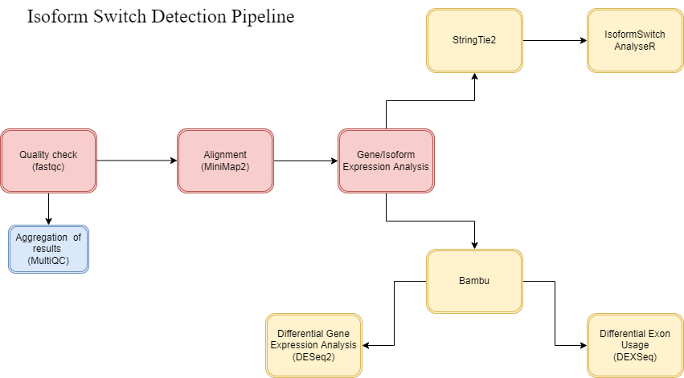

This is OMICSS 2022 Nanopore RNA-seq data analysis project.

PROCESSING STEPS

1. Quality Check
For base quality check we performed FastQC on every direct cDNA fastq file. After, we aggregated results by using MultiQC tool. 

ONT_RNA_processing/scripts/quality_check.sh

2. Alignment
At first we aligned reads on whole genome and after, on transcriptome data using MiniMap2 tool.

ONT_RNA_processing/scripts/genome_alignment.sh
ONT_RNA_processing/scripts/transcriptome_alignment.sh

3. Isoform Expression Analysis
For isoform expression analysis we tried to compare 2 tools - StringTie together with IsoformSwitchAnalyzeR and Bambu.

ONT_RNA_processing/scripts/stringtie_quantification.sh
ONT_RNA_processing/scripts/bambu.R
ONT_RNA_processing/scripts/bambu.sh

_Bambu_

bam.list contains all the bam files from /data/groups/group_3/alignments/ont_bams_genome folder.
direct_cdna_samples contains all directcDNA files
fa.file is the genome fasta file Homo_sapiens.GRCh38.dna_sm.primary_assembly.fa.
gtf.file is the gtf fole Homo_sapiens.GRCh38.91.gtf. 
prepareAnnotations method takes gtf.file as an input and stores the output CompressedGRangesList file in bambuAnnotations variable. 
For bambu method has direct_cdna_samples, bambuAnnotations and fa.file are given as an input to run in 10 threads and its output is saved in se variable.
The output is saved in se.RData file. 

_StringTie2_

StringTie2 assembles RNA-Seq alignments into transcripts. It can assmeble ling reads and also gives us proper output for continuing work with IsoformSwitchAnalyzeR. 

ONT_RNA_processing/scripts/stringtie_quantification.sh 

_IsoformSwitchAnalyzeR_

IsoformSwitchAnalyzeR works perfectly with input imported from StringTie2. We proceeded with this tutorial

https://bioconductor.org/packages/release/bioc/vignettes/IsoformSwitchAnalyzeR/inst/doc/IsoformSwitchAnalyzeR.html#advice-for-running-external-sequence-analysis-tools-and-downloading-results

ONT_RNA_processing/scripts/isoSwitch.R 

Via this script we detected and visualized isoform switches. For the part 2 we did some external analysis with tools that are described in the tutorial above. 

